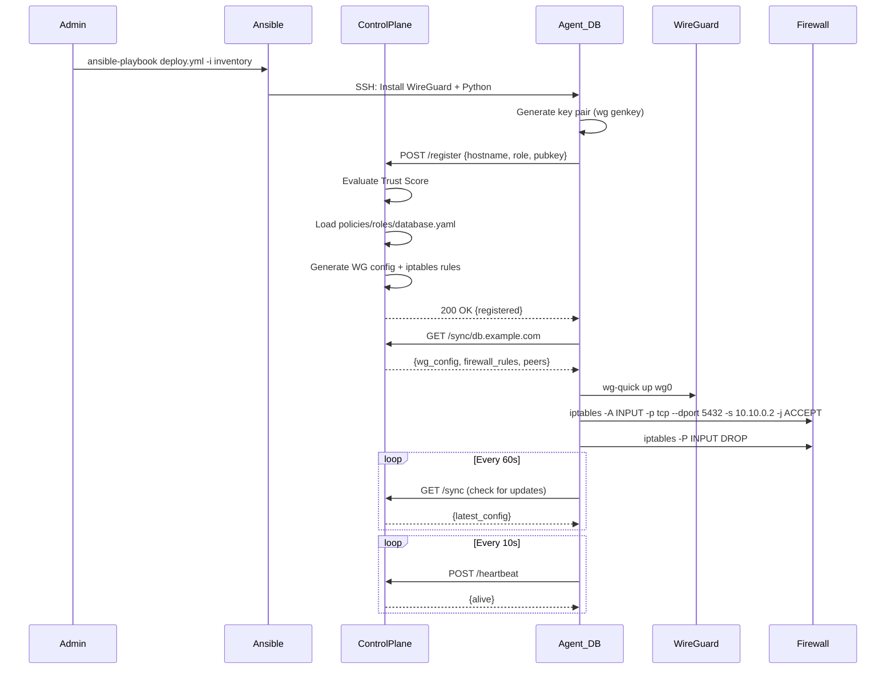

**User:**
từ nguồn : https://github.com/maithanhduyan/zero-trust-netwoking
Thiết kế control-plane kết nối ansible với wireguard như thế nào?

**AI (Sonnet4.5):**
Dựa trên repository bạn đang xây dựng, tôi sẽ giúp bạn thiết kế **Control Plane kết nối Ansible với WireGuard** một cách chi tiết.

## Kiến trúc Control Plane

## Thiết kế chi tiết



### 1. **API Endpoints (Control Plane)**

Tạo file `control-plane/api/v1/endpoints.py`:

```python
from fastapi import FastAPI, HTTPException, Depends
from pydantic import BaseModel
import subprocess
import json
from typing import List, Dict

app = FastAPI(title="Zero Trust Control Plane")

# ===== DATA MODELS =====
class NodeRegister(BaseModel):
    hostname: str
    role: str  # database, app, ops
    public_key: str
    ip_address: str

class NodeConfig(BaseModel):
    wireguard_config: str
    firewall_rules: List[str]
    peers: List[Dict]

# ===== DATABASE (simplified) =====
# Trong production nên dùng SQLAlchemy
nodes_db = {}  # {hostname: NodeRegister}

# ===== POLICY ENGINE =====
def evaluate_trust(node: NodeRegister) -> bool:
    """Trust Algorithm - Kiểm tra node có đủ điều kiện không"""
    # Ví dụ đơn giản: Kiểm tra role hợp lệ
    valid_roles = ["database", "app", "ops"]
    return node.role in valid_roles

def generate_wireguard_config(node: NodeRegister) -> str:
    """Tạo config WireGuard cho node này"""
    # Lấy danh sách peers theo policy
    peers = get_allowed_peers(node.role)

    config = f"""[Interface]
PrivateKey = <node-private-key>
Address = {allocate_ip(node.hostname)}
ListenPort = 51820

"""
    for peer in peers:
        config += f"""[Peer]
PublicKey = {peer['public_key']}
AllowedIPs = {peer['ip']}/32
Endpoint = {peer['endpoint']}
PersistentKeepalive = 25

"""
    return config

def generate_firewall_rules(node: NodeRegister) -> List[str]:
    """Tạo iptables rules theo role"""
    rules = []

    if node.role == "database":
        # Chỉ cho phép app kết nối port 5432
        rules.append("iptables -A INPUT -p tcp --dport 5432 -s 10.10.0.2 -j ACCEPT")
        rules.append("iptables -A INPUT -p tcp --dport 5432 -j DROP")

    elif node.role == "app":
        # Cho phép kết nối ra database và internet
        rules.append("iptables -A OUTPUT -d 10.10.0.3 -p tcp --dport 5432 -j ACCEPT")

    return rules

def get_allowed_peers(role: str) -> List[Dict]:
    """Lấy danh sách peer được phép kết nối theo role"""
    # Ví dụ: app được kết nối với database
    peers = []
    for hostname, node in nodes_db.items():
        if role == "app" and node.role == "database":
            peers.append({
                "hostname": hostname,
                "public_key": node.public_key,
                "ip": allocate_ip(hostname),
                "endpoint": f"{node.ip_address}:51820"
            })
    return peers

def allocate_ip(hostname: str) -> str:
    """IPAM: Cấp phát IP ảo cho node"""
    # Simplified: hash hostname để tạo IP
    ip_suffix = sum(ord(c) for c in hostname) % 250 + 2
    return f"10.10.0.{ip_suffix}"

# ===== ANSIBLE INTEGRATION =====
def run_ansible_playbook(hostname: str, playbook: str):
    """Chạy Ansible playbook lên target host"""
    cmd = [
        "ansible-playbook",
        f"infrastructure/ansible/{playbook}",
        "-i", f"{hostname},",  # Dynamic inventory
        "-e", f"target_host={hostname}"
    ]

    result = subprocess.run(cmd, capture_output=True, text=True)
    if result.returncode != 0:
        raise HTTPException(status_code=500, detail=result.stderr)

    return result.stdout

# ===== API ROUTES =====
@app.post("/api/v1/register")
async def register_node(node: NodeRegister):
    """Agent gọi để đăng ký vào hệ thống"""

    # 1. Evaluate Trust
    if not evaluate_trust(node):
        raise HTTPException(status_code=403, detail="Node không đạt yêu cầu Trust")

    # 2. Lưu vào database
    nodes_db[node.hostname] = node

    # 3. Chạy Ansible để setup WireGuard
    try:
        run_ansible_playbook(node.hostname, "setup-wireguard.yml")
    except Exception as e:
        raise HTTPException(status_code=500, detail=str(e))

    return {"status": "registered", "message": "Node đã được thêm vào mạng"}

@app.get("/api/v1/sync/{hostname}")
async def sync_config(hostname: str) -> NodeConfig:
    """Agent gọi để lấy config mới nhất"""

    node = nodes_db.get(hostname)
    if not node:
        raise HTTPException(status_code=404, detail="Node không tồn tại")

    # Generate fresh config
    wg_config = generate_wireguard_config(node)
    fw_rules = generate_firewall_rules(node)
    peers = get_allowed_peers(node.role)

    return NodeConfig(
        wireguard_config=wg_config,
        firewall_rules=fw_rules,
        peers=peers
    )

@app.post("/api/v1/heartbeat/{hostname}")
async def heartbeat(hostname: str):
    """Agent gửi heartbeat định kỳ"""
    if hostname not in nodes_db:
        raise HTTPException(status_code=404, detail="Node chưa đăng ký")

    # Update last_seen timestamp (bỏ qua trong ví dụ này)
    return {"status": "alive"}

@app.post("/api/v1/admin/reload-policy")
async def reload_policy():
    """Admin trigger reload policy từ files"""
    # Đọc policies/ directory và cập nhật rules
    # Sau đó trigger sync tất cả agents
    return {"status": "policy reloaded"}

# ===== MAIN =====
if __name__ == "__main__":
    import uvicorn
    uvicorn.run(app, host="0.0.0.0", port=8000)
```

### 2. **Ansible Playbook kết nối với WireGuard**

Tạo file `infrastructure/ansible/setup-wireguard.yml`:

```yaml
# infrastructure/ansible/setup-wireguard.yml
- name: Zero Trust Network - WireGuard Setup
  hosts: "{{ target_host }}"
  become: yes
  vars:
    wg_interface: wg0
    control_plane_api: "https://control.example.com:8000"

  tasks:
    # ===== 1. Cài đặt WireGuard =====
    - name: Install WireGuard (Ubuntu/Debian)
      apt:
        name:
          - wireguard
          - wireguard-tools
        state: present
        update_cache: yes
      when: ansible_os_family == "Debian"

    - name: Install WireGuard (CentOS/RHEL)
      yum:
        name:
          - wireguard-tools
        state: present
      when: ansible_os_family == "RedHat"

    # ===== 2. Generate Key Pair =====
    - name: Check if WireGuard key exists
      stat:
        path: /etc/wireguard/privatekey
      register: wg_private_key

    - name: Generate WireGuard private key
      shell: wg genkey > /etc/wireguard/privatekey
      when: not wg_private_key.stat.exists

    - name: Set permission for private key
      file:
        path: /etc/wireguard/privatekey
        mode: "0600"

    - name: Generate WireGuard public key
      shell: wg pubkey < /etc/wireguard/privatekey > /etc/wireguard/publickey
      when: not wg_private_key.stat.exists

    - name: Read public key
      slurp:
        src: /etc/wireguard/publickey
      register: wg_pubkey

    # ===== 3. Gọi Control Plane để đăng ký =====
    - name: Register node with Control Plane
      uri:
        url: "{{ control_plane_api }}/api/v1/register"
        method: POST
        body_format: json
        body:
          hostname: "{{ ansible_hostname }}"
          role: "{{ node_role }}" # Truyền từ inventory
          public_key: "{{ wg_pubkey['content'] | b64decode | trim }}"
          ip_address: "{{ ansible_default_ipv4.address }}"
        headers:
          Content-Type: "application/json"
        status_code: 200
      register: register_result

    # ===== 4. Lấy config từ Control Plane =====
    - name: Fetch WireGuard config from Control Plane
      uri:
        url: "{{ control_plane_api }}/api/v1/sync/{{ ansible_hostname }}"
        method: GET
        return_content: yes
      register: wg_config

    - name: Write WireGuard config file
      copy:
        content: "{{ wg_config.json.wireguard_config }}"
        dest: "/etc/wireguard/{{ wg_interface }}.conf"
        mode: "0600"

    # ===== 5. Enable và Start WireGuard =====
    - name: Enable IP forwarding (for routing)
      sysctl:
        name: net.ipv4.ip_forward
        value: "1"
        state: present
        reload: yes

    - name: Enable WireGuard interface
      systemd:
        name: "wg-quick@{{ wg_interface }}"
        enabled: yes
        state: started

    # ===== 6. Apply Firewall Rules =====
    - name: Apply iptables rules
      shell: "{{ item }}"
      loop: "{{ wg_config.json.firewall_rules }}"
      when: wg_config.json.firewall_rules | length > 0

    - name: Save iptables rules
      shell: iptables-save > /etc/iptables/rules.v4
      when: ansible_os_family == "Debian"

    # ===== 7. Setup Agent Service =====
    - name: Copy agent binary
      copy:
        src: "../../agent/agent.py"
        dest: /usr/local/bin/ztn-agent
        mode: "0755"

    - name: Create agent systemd service
      copy:
        content: |
          [Unit]
          Description=Zero Trust Network Agent
          After=network.target wg-quick@{{ wg_interface }}.service

          [Service]
          Type=simple
          ExecStart=/usr/bin/python3 /usr/local/bin/ztn-agent
          Restart=always
          RestartSec=10
          Environment="CONTROL_PLANE_API={{ control_plane_api }}"

          [Install]
          WantedBy=multi-user.target
        dest: /etc/systemd/system/ztn-agent.service

    - name: Enable and start agent
      systemd:
        name: ztn-agent
        enabled: yes
        state: started
        daemon_reload: yes

    # ===== 8. Verify =====
    - name: Check WireGuard status
      command: wg show
      register: wg_status

    - name: Display WireGuard status
      debug:
        msg: "{{ wg_status.stdout_lines }}"
```

### 3. **Agent Implementation**

Tạo file `agent/agent.py`:

```python
#!/usr/bin/env python3
"""
Zero Trust Network Agent
Chạy trên mỗi VPS để sync config từ Control Plane
"""

import os
import time
import requests
import subprocess
import logging
from pathlib import Path

# ===== CONFIG =====
CONTROL_PLANE_API = os.getenv("CONTROL_PLANE_API", "http://localhost:8000")
HOSTNAME = subprocess.check_output("hostname", text=True).strip()
WG_INTERFACE = "wg0"
SYNC_INTERVAL = 60  # seconds

logging.basicConfig(level=logging.INFO, format='%(asctime)s - %(message)s')
logger = logging.getLogger(__name__)

# ===== HELPER FUNCTIONS =====
def call_api(endpoint: str, method: str = "GET", data: dict = None):
    """Gọi API của Control Plane"""
    url = f"{CONTROL_PLANE_API}{endpoint}"
    try:
        if method == "GET":
            response = requests.get(url, timeout=10)
        elif method == "POST":
            response = requests.post(url, json=data, timeout=10)

        response.raise_for_status()
        return response.json()
    except requests.exceptions.RequestException as e:
        logger.error(f"API call failed: {e}")
        return None

def apply_wireguard_config(config: str):
    """Apply WireGuard config"""
    config_path = f"/etc/wireguard/{WG_INTERFACE}.conf"

    # Backup old config
    if Path(config_path).exists():
        subprocess.run(["cp", config_path, f"{config_path}.bak"])

    # Write new config
    with open(config_path, 'w') as f:
        f.write(config)

    # Restart WireGuard
    subprocess.run(["wg-quick", "down", WG_INTERFACE], stderr=subprocess.DEVNULL)
    result = subprocess.run(["wg-quick", "up", WG_INTERFACE],
                          capture_output=True, text=True)

    if result.returncode == 0:
        logger.info("WireGuard config applied successfully")
    else:
        logger.error(f"Failed to apply WireGuard config: {result.stderr}")
        # Rollback
        subprocess.run(["cp", f"{config_path}.bak", config_path])
        subprocess.run(["wg-quick", "up", WG_INTERFACE])

def apply_firewall_rules(rules: list):
    """Apply iptables rules"""
    # Flush old rules (cẩn thận!)
    subprocess.run(["iptables", "-F", "INPUT"])
    subprocess.run(["iptables", "-F", "OUTPUT"])

    # Apply new rules
    for rule in rules:
        try:
            subprocess.run(rule.split(), check=True)
            logger.info(f"Applied rule: {rule}")
        except subprocess.CalledProcessError as e:
            logger.error(f"Failed to apply rule: {rule} - {e}")

    # Default policy
    subprocess.run(["iptables", "-P", "INPUT", "DROP"])
    subprocess.run(["iptables", "-P", "FORWARD", "DROP"])
    subprocess.run(["iptables", "-P", "OUTPUT", "ACCEPT"])

    # Allow established connections
    subprocess.run(["iptables", "-A", "INPUT", "-m", "state",
                   "--state", "ESTABLISHED,RELATED", "-j", "ACCEPT"])

    # Save rules
    subprocess.run(["iptables-save", "-f", "/etc/iptables/rules.v4"])

def sync_config():
    """Đồng bộ config từ Control Plane"""
    logger.info("Syncing configuration from Control Plane...")

    data = call_api(f"/api/v1/sync/{HOSTNAME}")
    if not data:
        logger.error("Failed to fetch config")
        return

    # Apply WireGuard config
    if 'wireguard_config' in data:
        apply_wireguard_config(data['wireguard_config'])

    # Apply firewall rules
    if 'firewall_rules' in data:
        apply_firewall_rules(data['firewall_rules'])

    logger.info("Configuration synced successfully")

def send_heartbeat():
    """Gửi heartbeat để báo Control Plane node còn sống"""
    result = call_api(f"/api/v1/heartbeat/{HOSTNAME}", method="POST")
    if result:
        logger.debug("Heartbeat sent")
    else:
        logger.warning("Heartbeat failed")

def collect_metrics():
    """Thu thập thông tin node để gửi lên (for Trust Algorithm)"""
    metrics = {
        "hostname": HOSTNAME,
        "uptime": get_uptime(),
        "wg_status": get_wg_status(),
        "active_connections": get_active_connections()
    }
    return metrics

def get_uptime():
    """Lấy uptime của hệ thống"""
    with open('/proc/uptime', 'r') as f:
        return float(f.readline().split()[0])

def get_wg_status():
    """Kiểm tra trạng thái WireGuard"""
    result = subprocess.run(["wg", "show", WG_INTERFACE],
                          capture_output=True, text=True)
    return "active" if result.returncode == 0 else "inactive"

def get_active_connections():
    """Đếm số kết nối đang active"""
    result = subprocess.run(["ss", "-tn"], capture_output=True, text=True)
    return len(result.stdout.split('\n')) - 1

# ===== MAIN LOOP =====
def main():
    logger.info(f"Zero Trust Agent started for {HOSTNAME}")

    # Initial sync
    sync_config()

    # Main loop
    heartbeat_counter = 0
    while True:
        try:
            # Sync config mỗi phút
            time.sleep(SYNC_INTERVAL)
            sync_config()

            # Heartbeat mỗi 10 giây
            heartbeat_counter += 1
            if heartbeat_counter % 6 == 0:  # 60s / 10s = 6
                send_heartbeat()
                heartbeat_counter = 0

        except KeyboardInterrupt:
            logger.info("Agent stopped by user")
            break
        except Exception as e:
            logger.error(f"Unexpected error: {e}")
            time.sleep(10)  # Retry after 10 seconds

if __name__ == "__main__":
    main()
```

### 4. **Ansible Inventory động**

Tạo file `infrastructure/ansible/inventory/hosts.ini`:

```
# infrastructure/ansible/inventory/hosts.ini
# Inventory tĩnh cho lần setup đầu tiên

[control_plane]
control.example.com ansible_host=192.168.1.10 ansible_user=root

[database]
db.example.com ansible_host=192.168.1.11 ansible_user=root node_role=database

[app]
app.example.com ansible_host=192.168.1.12 ansible_user=root node_role=app

[ops]
ops.example.com ansible_host=192.168.1.13 ansible_user=root node_role=ops

[all:vars]
ansible_python_interpreter=/usr/bin/python3
control_plane_api=https://control.example.com:8000
```

### 5. **Policy Definition (YAML)**

Tạo file `policies/roles/database.yaml`:

```yaml
# policies/roles/database.yaml
---
role: database
description: "PostgreSQL database server policy"

# Các role được phép kết nối VÀO node này
allowed_inbound:
  - role: app
    ports:
      - 5432
    protocol: tcp
    description: "Allow application tier to connect to database"

  - role: ops
    ports:
      - 22
      - 5432
    protocol: tcp
    description: "Allow ops team SSH and DB access"

# Các dịch vụ node này được phép kết nối RA
allowed_outbound:
  - destination: internet
    ports:
      - 80
      - 443
    protocol: tcp
    description: "Allow package updates"

# Yêu cầu bảo mật
security_requirements:
  os_version: "Ubuntu 20.04+"
  firewall: enabled
  wireguard: required
  disk_encryption: recommended

# Trust Score thresholds
trust_thresholds:
  minimum_score: 70
  factors:
    - name: uptime
      weight: 20
      condition: "> 24h"

    - name: patch_status
      weight: 30
      condition: "up-to-date"

    - name: failed_login_attempts
      weight: 50
      condition: "< 5 in 24h"
```

## Workflow hoàn chỉnh


## Chạy thử nghiệm

```bash
# 1. Khởi động Control Plane
cd control-plane
python -m uvicorn api.v1.endpoints:app --reload

# 2. Deploy agent lên VPS
cd infrastructure/ansible
ansible-playbook setup-wireguard.yml -i inventory/hosts.ini --limit database

# 3. Kiểm tra logs
ssh db.example.com "journalctl -u ztn-agent -f"

# 4. Kiểm tra WireGuard status
ssh db.example.com "wg show"

# 5. Test kết nối
ssh app.example.com "ping 10.10.0.11"  # Ping DB qua tunnel
ssh app.example.com "psql -h 10.10.0.11 -U postgres"  # Kết nối DB
```

## Điểm mạnh của thiết kế này

1. **Tách biệt Control Plane và Data Plane**: API server không xử lý traffic thực tế, chỉ quản lý policy
2. **Policy as Code**: Dễ review, version control, rollback
3. **Ansible Integration**: Tự động hóa deployment, giảm lỗi manual
4. **Zero Trust thực sự**: Mọi kết nối đều phải qua Policy Engine evaluation
5. **Có thể mở rộng**: Dễ dàng thêm node mới bằng cách chạy Ansible playbook

## Bạn có muốn tôi giải thích chi tiết thêm phần nào không? Ví dụ như Trust Algorithm scoring, hoặc cách xử lý node bị compromise?

---
